  
  

   

  

---

📓 Programming Fundamentals

 

C# · SQL · OOP · Software Engineering · Clean Architecture · SOLID Principles

⚙️ Backend Development

 

ASP.NET Core · REST APIs · Entity Framework Core · LINQ · JWT · Authentication · Authorization · Dependency Injection · Middleware

🗄️ Databases

 

SQL Server · SSMS · Stored Procedures · Views · Functions · Indexes · Performance Optimization · Database Design

🚀 DevOps & Cloud

 

Docker Fundamentals · CI/CD Concepts · Linux Basics · Cloud Fundamentals

---

## 👋 About Me

Backend .NET Developer passionate about building scalable enterprise systems with Microsoft technologies — **ASP.NET Core**, **REST APIs**, **SQL Server**, and **Entity Framework Core**.

Skilled in authentication/authorization, database design, SQL performance optimization, Clean Architecture, SOLID, OOP, and dependency injection. Proficient with Postman/Swagger, Git/GitHub, deployment support, and DevOps fundamentals (Docker, CI/CD, Linux, cloud).

Currently working at **Tahawul Solutions** on enterprise applications, including an NGO ERP platform. Seeking **Backend .NET roles** to deliver enterprise software with multinational and Gulf teams, including remote opportunities.

- 📍 Cairo, Egypt
- 🎓 Fayoum University — Faculty of Computer Science and Artificial Intelligence (2026)
- 🌐 Arabic (Native) · English (Professional Working Proficiency)

---

## 🧰 Tech Stack

  
    
  

 

  
  
  
  
  
  

---

## 💼 Experience

**Backend .NET Developer — Tahawul Solutions, Cairo, Egypt**
`Full Time`

Engineered ASP.NET Core backends for enterprise applications, including the **NGO ERP System**. Delivered REST APIs, a licensing module, authentication/authorization, SQL Server / EF Core data layers, production bug fixes, and client-server deployments across Fayoum and Beni Suef. Documented APIs with Swagger and Postman, supported releases remotely and on-site, and maintained Git/GitHub workflows.

---

## 🚀 Featured Projects

**Medora — Online Medical Appointment Booking System**
`Graduation Project` `Backend Developer` `Grade: A+`

Solely developed the end-to-end backend for a medical appointment booking platform using Clean Architecture, ASP.NET Core, SQL Server, Entity Framework Core, REST APIs, and JWT authentication. Built doctor/patient management, appointment scheduling, and role-based auth. Deployed APIs on ASP.NET Monster and integrated Cloudinary for image upload.

[GitHub](https://github.com/YousefZydan/Medora)

**NGO ERP System — Tahawul Solutions**
`Enterprise Application`

Enterprise ERP platform for NGOs covering backend APIs, licensing, authentication/authorization, SQL Server data layers, production support, and on-site/remote deployment.

---

## 🎓 Education

**Fayoum University** — Faculty of Computer Science and Artificial Intelligence
`Graduation Year: 2026` `CGPA: B`

---

## 📜 Training & Certifications

- **Professional Backend .NET Training** — EBLA Computer Consultancy, Kuwait  
  ASP.NET Core, SQL Server, REST APIs, and enterprise software development  
  [View Certificate](https://drive.google.com/file/d/1famTkUPKs0Lc3b4N8HIN4SzCtXnE_6AM/view?usp=sharing)

- **Ministry of Communications and Information Technology Certificate**  
  [View Certificate](https://drive.google.com/file/d/1PCE6D6DnMiY6OpAjt2nIguP0rRSRksET/view?usp=sharing)

- **Million AI Experts Initiative** — Dubai, UAE  
  Applied AI program on practical AI tools and professional prompt engineering  
  [View Certificate](https://drive.google.com/file/d/1ZRw21yphXMg_cBd0n3YznYg3UjkyBvvj/view?usp=drive_link)

---

## 🐍 Contribution Snake

  <picture>
    <source media="(prefers-color-scheme: dark)" srcset="https://raw.githubusercontent.com/YousefZydan/YousefZydan/output/github-contribution-grid-snake-dark.svg" />
    <source media="(prefers-color-scheme: light)" srcset="https://raw.githubusercontent.com/YousefZydan/YousefZydan/output/github-contribution-grid-snake.svg" />
    
  </picture>

  

---

## 📊 GitHub Statistics

  
  
   
  

---

**Open to Backend .NET roles** with multinational and Gulf teams, including remote opportunities.

